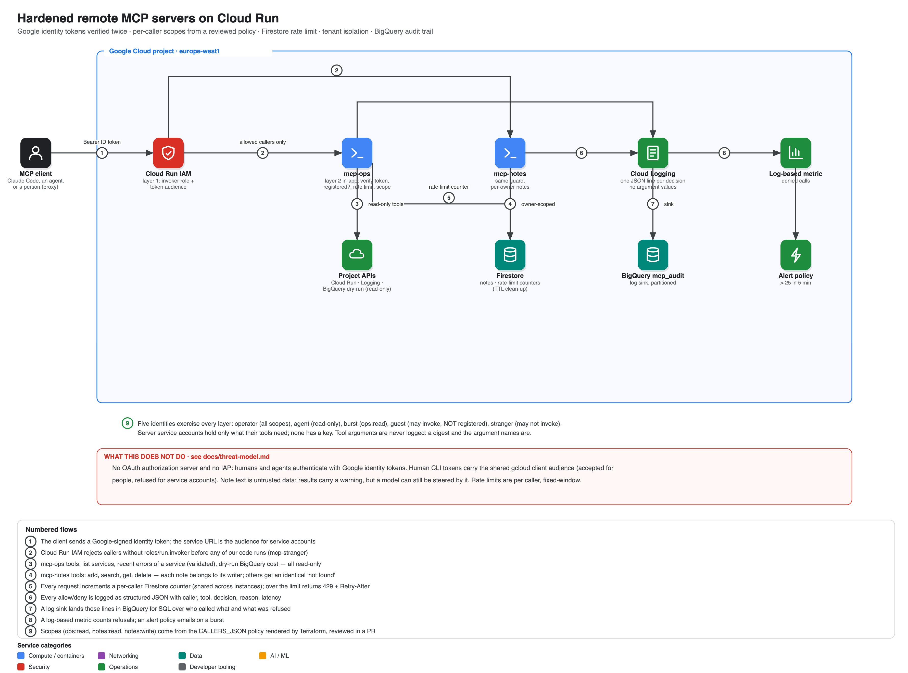

# Hardened remote MCP servers on Cloud Run

Two MCP servers (`ops`, read-only project introspection; `notes`, a tiny multi-tenant store) reachable
over the internet only by named callers, each authenticated with a **Google identity token verified
twice** — once by Cloud Run IAM, once by the app itself — then checked against a **reviewed scope
policy**, **rate-limited per caller in Firestore**, and **audited to BigQuery** with argument values
never logged.

> **Status: deployed and verified live** (project `claude-code-507112`, europe-west1, 2026-09-28).
> `./scripts/test.sh`: **52 passed, 0 failed** — see [docs/test-results.md](docs/test-results.md), which
> documents a genuine Cloud Run platform behavior (not a bug here) found by debugging a live 401: the
> front end truncates the Authorization header for tokens issued to Google's own OAuth client id.

```bash
gcloud config set project <your-project>   # billing linked; the rest is auto-detected
./scripts/up.sh    # Firestore + audit sink + identities + registry -> image -> both services -> live tests
./scripts/down.sh  # delete everything
```



## What it proves

| Claim | Mechanism | Proven by |
|---|---|---|
| A stranger cannot reach the tools | Cloud Run IAM (`roles/run.invoker`) refuses before the app runs | test §2 |
| A registered-looking but unlisted caller is refused | App-level policy lookup → 403 `unregistered_caller` | test §3 |
| Read-only callers cannot write | Per-tool scope decorator | test §3 |
| One caller cannot read another's notes | Owner-scoped queries; identical error for "not yours" and "doesn't exist" | test §5 |
| A runaway caller cannot starve others | Per-caller Firestore rate limit; other callers unaffected | test §6 |
| Nothing sensitive lands in logs | Argument values never logged; asserted with a live marker | test §7 |
| Servers can't do more than their tools need | Exact role sets asserted, no keys | test §8 |
| A human's raw CLI token cannot authenticate here | Documented platform behavior, tested as a permanent regression check | test §1b, [ADR 0005](docs/adr/0005-human-callers-impersonate-too.md) |

## Design decisions

| ADR | Decision |
|---|---|
| [0001](docs/adr/0001-identity-tokens-not-oauth-server.md) | Google identity tokens + Cloud Run IAM, not an OAuth authorization server |
| [0002](docs/adr/0002-policy-in-terraform-scopes-per-tool.md) | The access policy is data in Terraform; each tool declares one scope |
| [0003](docs/adr/0003-audit-without-arguments.md) | Audit every decision; never log argument values |
| [0004](docs/adr/0004-rate-limit-in-firestore.md) | Rate limiting is shared state in Firestore, with TTL cleanup |
| [0005](docs/adr/0005-human-callers-impersonate-too.md) | Human operators authenticate as a service account too — found live |

## Runbooks

[docs/runbooks](docs/runbooks/README.md): build & teardown · connect an agent (Claude Code) · investigate denials · add a tool or caller.

## Repository layout

```
app/mcpkit/    auth (verify token) · policy (who may do what) · ratelimit (Firestore) · audit (BigQuery) · guard (glue)
app/servers/   ops.py (read-only project tools) · notes.py (tenant-isolated notes)
terraform/     Firestore · audit sink+alerts · 7 service accounts (2 servers, build, operator + 3 test identities) · 2 Cloud Run services
scripts/       up · down · test (5 identities exercise every layer) · mcp_client.py (minimal reference client)
```

## Cost & safety

Both services scale to zero; Firestore and BigQuery usage from the tests is far below free-tier limits.
`down.sh` removes everything, including the Firestore database.

## Known gaps (deliberate)

* **No OAuth authorization server / MCP-native auth flow.** Clients that only speak that flow need a proxy.
* **Note text is untrusted data passed to a model.** Results carry an explicit warning; the real mitigation is on the client (don't let an agent act on note content unsupervised).
* **`roles/logging.viewer` is project-wide** on the ops server (needed for `recent_errors` across services); a per-resource-type log view would narrow it further.
* **Fixed-window rate limiting** allows up to a 2× burst at a minute boundary.
